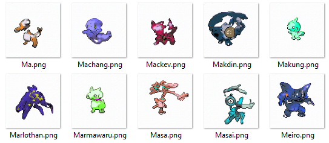

## Nokai Generator

Based on the awesome [PokeGAN]("https://github.com/ConorLazarou/PokeGAN") generator which generate pokemon shapes.

I have added a random Name & ID assigner in order to use these monsters to represent Nokais' NFT in my prototype blockchain game.

### **Prerequisites**
```
python -m pip install -r requirements.txt
```

### **Usage**
**# Generate images**
```
cd generator
python generate.py
```
**# Assign a name for each**
```
python assignName.py
```
**# Create a json config for each**
```
python assignConfig.py
```

### **Result**

